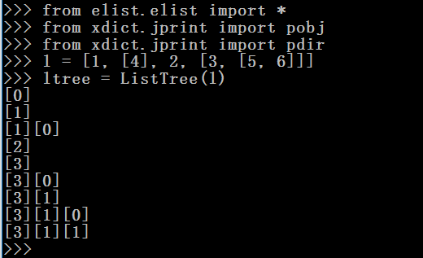

# elist
>__handle list ,nested list tree__

# install
>__pip3 install elist__

## _class_ ListTree

__1. \_\_init\_\_(alist)__
--------------------------

        from elist.elist import *
        from xdict.jprint import pobj
        from xdict.jprint import pdir
        l = [1, [4], 2, [3, [5, 6]]]
        ltree = ListTree(l)

__2. \_\_repr\_\___
-------------------

        l
        ltree
        pobj(ltree.showlog)

__3. tree(**kwargs)__
---------------------

        pathlists = ltree.tree()
        pathlists = ltree.tree(leaf_only=True)
        pathlists = ltree.tree(leaf_only=True,from_lv=1,to_lv=2)
        pathlists = ltree.tree(non_leaf_only=True)

__4. flatten()__
----------------

        flat = ltree.flatten()
        flat
        ltree.flatWidth
        ltree.depth

__5. dig(howmanysteps)__
------------------------

        depthfirst = ltree.dig()
        depthfirst = ltree.dig(2)
        depthfirst = ltree.dig(5)

__6. level(whichlevel,**kwargs)__
---------------------------------

        level = ltree.level(1)
        level = ltree.level(1,leaf_only=True)
        level = ltree.level(1,non_leaf_only=True)
        level = ltree.level(2)
        level = ltree.level(3)
        

__7. include(\*pathlist,**kwargs)__
-----------------------------------

        l[3][1][0]
        ltree.include(3,1,0)
        l[3][1][2]
        ltree.include(pathlist = [3,1,2])
        

__8. \_\_getitem\_\_(\*pathlist)__
----------------------------------

        ltree[1,0]
        l[1][0]
        ltree[3,1,1]
        l[3][1][1]

__9. search(value,**kwargs)__
-----------------------------

        from xdict.TestLib.genrand import gen_random_recursive_only_list_data as randlist
        # lets generate a l for test,l is a big nested-list
        l = randlist()
        #the l looks like the below:
 

        #you can see the value "v_4" appears in different levels of the nested-list:

        ltree = ListTree(l)
        pathlists = ltree.search('v_4')
        pathlists.__len__()
        #we will found 125 match

 
        #......

        l[0]
        l[4][2][1][0][0][3]
        l[4][2][1][0][0][19][11]
        l[11][3]

lquery APIs:
------------

-------------------------------------------------------
>├──10. [parent](elist/Images/ListTree.search.4.png)
